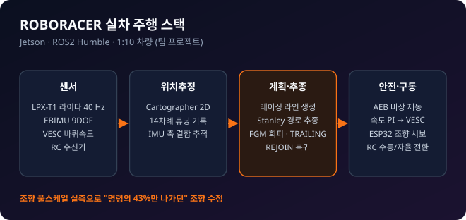
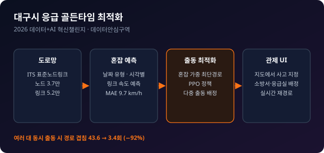
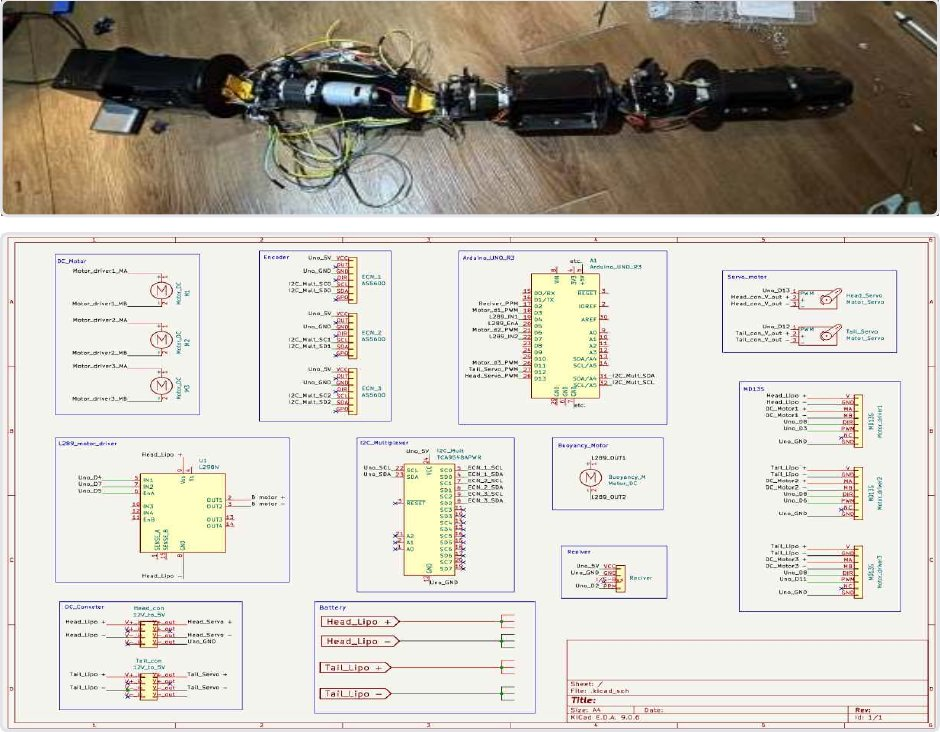
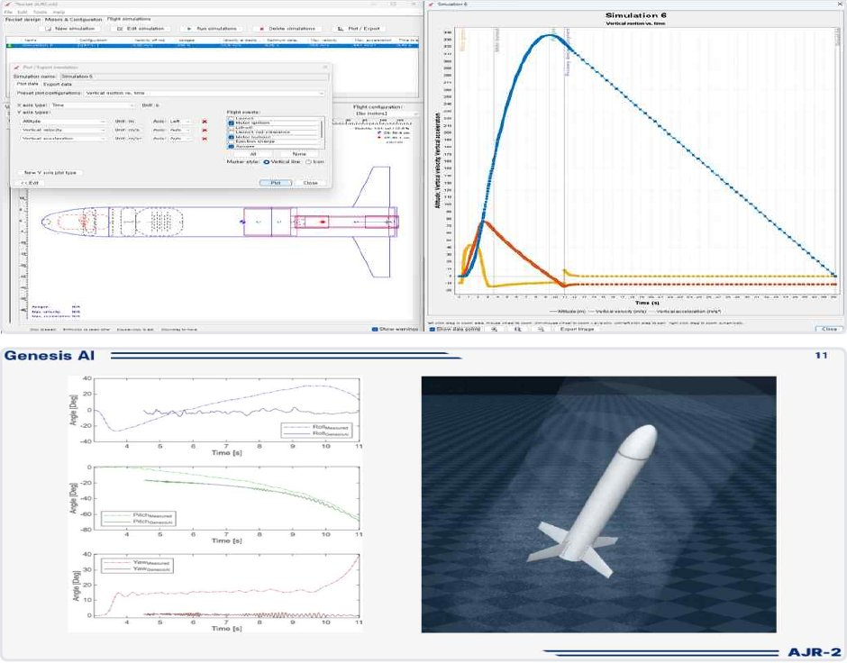
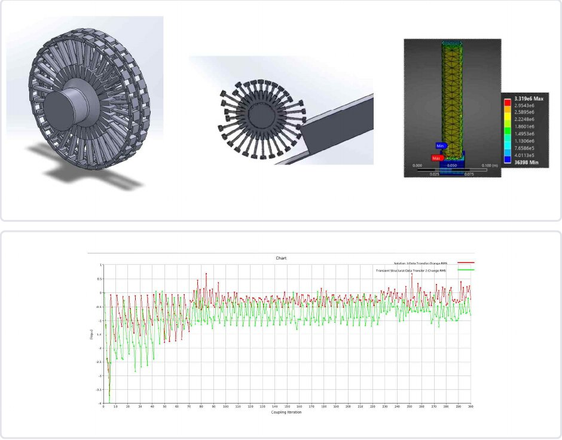

  

  <b>아주대학교 기계공학과</b> · ROBORACER 2026 출전팀 
  자율주행 레이싱카 · 차량 계측 장비 · 수중 로봇 · 로켓 · 유체-구조 해석까지 — 
  <b>시뮬레이션 결과를 그대로 믿지 않고 실측으로 검증하는 것</b>을 가장 중요하게 생각합니다.

  

  

 

## 🔧 Projects

<table>
<tr>
<td width="50%" valign="top">

### 🏎️ [지도 없이 달리는 레이싱카 강화학습](https://github.com/tkddn647-ship-it/2027_F1tenth_test)
Reinforcement Learning · Sim-to-Real

지도·위치추정 없이 **라이다·IMU·바퀴속도만으로** 조향과 속도를 내는 제어기를 강화학습으로 만들고, **Jetson 실차에 올려 주행**까지 연결.

- 40 Hz **비대칭 SAC** — critic만 레이싱 라인을 보고 학습
- 시뮬레이터 직접 구현: 1125빔 라이다, 서보·구동 지연, 브레이크 없는 구동계
- 시뮬 ifac **10.9 s** (pure pursuit 11.5 s, FTG 18.0 s)
- 초파리 **hemibrain 커넥톰** 배선을 메모리로 쓰는 정책 실험

`PyTorch` `SB3` `Gymnasium` `ROS2` `Jetson`

</td>
<td width="50%" valign="top">

### 🏁 [ROBORACER 실차 주행 스택](https://github.com/tkddn647-ship-it/f1tenth_ajou)
Robotics · ROS2 · 팀 프로젝트

1:10 자율주행 레이싱카의 **센서 → 위치추정 → 경로 계획·추종 → 안전·구동** 전 과정을 Jetson 위에 구축.

- Jetson·ROS2 환경 구축, 라이다·IMU·차체 TF Tree 설계
- Cartographer SLAM 튜닝, VESC 실측 기반 캘리브레이션
- 레이싱 라인 + Stanley 추종, FGM 장애물 회피
- 직선 구간 맵 압축 문제를 스캔 매칭 범위 조정으로 해결
- 🏆 **학교 최초 출전, 본선 진출**

`ROS2` `C++` `Python` `Cartographer` `Jetson`
 관련: [jetson_code](https://github.com/tkddn647-ship-it/jetson_code)

</td>
</tr>
<tr>
<td width="50%" valign="top">

### ⚡ [AFA2026 차량 계측 시스템](https://github.com/tkddn647-ship-it/afa2026)
Formula Student · Embedded · Hardware · Server

전기차의 서스펜션·가속도·인버터/BMS·조향 데이터를 **STM32에서 한 타임라인으로 100 Hz 동기 수집**하고 실시간 대시보드·로깅·카메라 녹화까지 연결한 자작 데이터로거.

- 링 버퍼 + DMA 전송으로 수집 주기 **10 Hz → 100 Hz**
- 섀시 다이나모로 검증: 최고속도 계측 90 vs 87 km/h (**오차 약 3.4%**)
- 주행 영상과 로깅 데이터를 시간 동기화한 분석 화면
- **2인이 센서·통신·서버·분석 화면까지** 전 영역 설계·구축

`C` `STM32` `CAN` `Raspberry Pi` `FastAPI`

</td>
<td width="50%" valign="top">

### 🚑 [대구시 응급 골든타임 최적화](https://github.com/tkddn647-ship-it/Data_center)
Data + AI · 2026 데이터+AI 혁신챌린지

시간대별 혼잡을 예측해 **119 소방·구급 출동 경로를 최적화**하는 중앙관제 시뮬레이터.

- ITS 표준노드링크 도로망 **노드 3.7만 · 링크 5.2만**
- 혼잡 가중 최단경로 + PPO, 소방서·응급실 자동 배정
- 다중 출동 경로 겹침 **43.6 → 3.4회 (−92%)**
- 웹 관제 UI: 지도에서 사고 지정 → 실시간 재경로

`Python` `NetworkX` `PPO` `Flask` `Leaflet`

</td>
</tr>
<tr>
<td width="50%" valign="top">

### 🐍 수중형 장어로봇 다관절 제어
졸업작품 · Mechanism · Electronics · Firmware

5개 세그먼트가 파동형으로 움직이는 수중 장어로봇. **헤드 기구 설계부터 전기 배선, MCU 펌웨어, 제어기까지** 담당.

- 세그먼트 증가로 인한 I2C 주소 부족 → **I2C 멀티플렉서**로 해결
- PID로 모터 각속도 안정화, 세그먼트 간 위상차 유지로 파동 운동
- RC 조종기 스로틀 입력으로 직접 조작하는 인터페이스
- SolidWorks 헤드부 설계 → 3D 프린팅

`SolidWorks` `KiCad` `MCU Firmware` `PID` `I2C`

</td>
<td width="50%" valign="top">

### 🚀 시뮬레이션–실측 기반 로켓 설계
로켓 동아리 · 🏆 2025 전국대학교로켓 학술대회·발사대회 수상

무게중심–압력중심 관계로 핀·노즈콘을 설계하고, **실측 추력으로 시뮬레이션을 보정**해 목표 고도에 근접한 안정적 발사.

- OpenRocket으로 형상 비교, 핀은 SolidWorks 설계 → 3D 프린팅
- 대회용 연료·노즐 추력을 **로드셀로 직접 측정**해 추력곡선 반영
- Genesis AI 가상 비행 → 실측 Roll·Pitch·Yaw와 비교 분석
- 설계–시뮬레이션–실측–재설계 사이클을 보고서로 문서화

`OpenRocket` `SolidWorks` `Genesis AI` `Load Cell`

</td>
</tr>
<tr>
<td width="50%" valign="top">

### 🛞 가변 형상 바퀴 양방향 FSI 해석
융합설계 (5인 팀 · FSI 개인 수행)

팀이 스프링·감쇠로 단순화한 유체 감쇠 가정을 검증하기 위해 **유동–구조 해석을 연결한 양방향 FSI** 구성.

- 바퀴 내부를 비압축성 유체 영역으로 추출, 스포크 양방향 변형 허용
- 결과: 강성 목표의 약 6배, 감쇠 약 1/10
- 원인을 경계조건·메쉬 품질·연성 수렴으로 분석 → 실제 단차 조건 재해석 방향 도출

`Ansys CFX` `Transient Structural` `System Coupling`

</td>
<td width="50%" valign="top">

### 💼 Experience & Awards

**무브와이즈랩 · 인턴 연구원** 2026.08 ~ 재직중 
카메라 기반 Costmap 설계 · 위험/안전 구역 기준 정의

**🏆 전국대학교로켓 학술대회·발사대회 수상** 2025.08

**🏁 ROBORACER · 학교 최초 출전 본선 진출**

**헬스 동아리 '득근득근' 창립·부회장** 2025.09 ~ 현재

**아주대학교 기계공학과** 2021.03 ~ 2027.08 (졸업예정)

</td>
</tr>
</table>

 

## 🧰 What I Work With

| 분야 | 사용 기술 |
|---|---|
| 🤖 로보틱스·자율주행 | ROS2 Humble, Cartographer, Stanley / Pure Pursuit, Follow-the-Gap, NVIDIA Jetson |
| 🧠 강화학습·AI | PyTorch, Stable-Baselines3 (SAC · PPO), Gymnasium, TorchScript / ONNX |
| 🔌 임베디드·하드웨어 | STM32 HAL · DMA, CAN, UART · SPI · I2C · ADC, ESP32, VESC, Raspberry Pi 5, KiCad |
| 🛠️ 기계 설계·해석 | SolidWorks, 3D 프린팅, Ansys CFX · Mechanical · System Coupling, OpenRocket, Genesis AI, MATLAB |
| 🌐 데이터·서버 | Flask, FastAPI, UDP/TCP, AWS, NetworkX, GIS(ITS 표준노드링크, Leaflet) |

 

  

